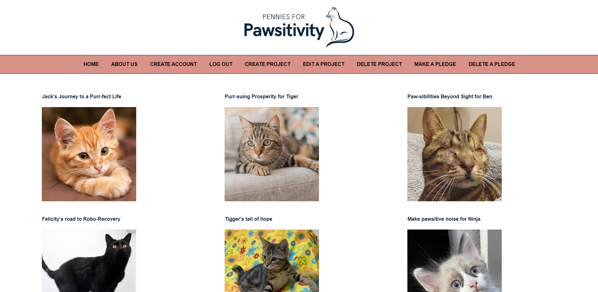

# Pennies for Pawsitivity
This is a React "frontend" project I did during the SheCodes course.  

## About
Welcome to "Pennies for Pawsitivity" – the ultimate crowdfunding platform dedicated to spreading love, hope, and care for our feline friends. Our mission is to empower not-for-profit organisations that are tirelessly working to rescue, rehabilitate, and rehome cats in need. At "Pennies for Pawsitivity," we believe in the power of small contributions to create monumental change. Every penny donated goes directly towards transforming the lives of a kitten or cat in need. Our platform connects the organisations that pour their heart and soul into giving every cat a chance at a brighter future with compassionate and enthusiastic cat lovers with small change to spare.  

## Project requirements (Part B)
- [X] Create a project in the UI.
- [X] Pledge to a project in the UI.
- [X] Login/Logout in the UI.
- [X] Render pages for different devices nicely (media queries)
- [X] Delete a project in the UI.
- [X] Create an account in the UI.

## Submissions requirements

- [X] A link to the deployed project: [Pennies for Pawsitivity](https://marvelous-truffle-32a893.netlify.app/)

### Screenshot

